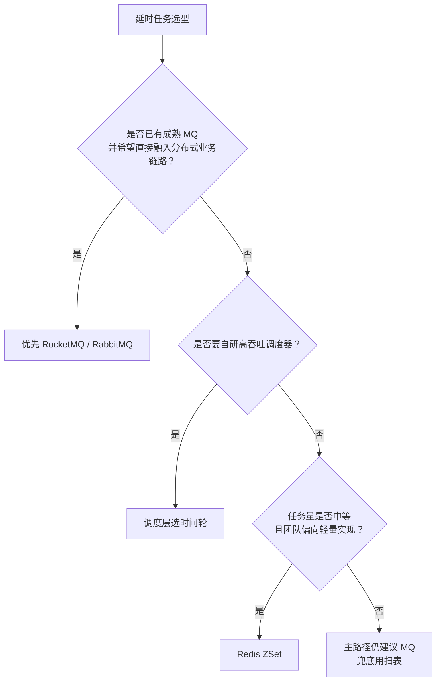

# 延时任务方案对比

## 适合人群

- 需要设计订单超时、支付超时、履约超时等延时任务链路的后端工程师
- 正在做消息队列、调度器、补偿任务选型的开发者
- 想把“会用一种方案”升级成“会做多方案取舍”的工程师

## 学习目标

- 理解主流延时任务方案的核心差异和适用边界
- 能从一致性、吞吐、恢复、复杂度几个维度做取舍
- 建立“触发层 + 状态机 + 补偿”的完整延时任务架构认知

## 快速导航

- [为什么延时任务值得单独做方案对比](#为什么延时任务值得单独做方案对比)
- [先给一个总结论](#先给一个总结论)
- [主流方案总览](#主流方案总览)
- [RocketMQ 延时消息](#rocketmq-延时消息)
- [RabbitMQ TTL + DLX](#rabbitmq-ttl--dlx)
- [Redis ZSet](#redis-zset)
- [时间轮](#时间轮)
- [Kafka 该怎么放到这个话题里理解](#kafka-该怎么放到这个话题里理解)
- [怎么选最合适](#怎么选最合适)
- [推荐的组合方案](#推荐的组合方案)
- [常见误区](#常见误区)
- [面试回答模板](#面试回答模板)
- [落地检查清单](#落地检查清单)
- [结论](#结论)

## 为什么延时任务值得单独做方案对比

“延时任务”这个词听起来很简单，但它背后的实现方式差异非常大。

比如下面这些需求，本质上都可以归为延时任务：

- 订单 30 分钟未支付自动取消
- 支付后 10 分钟未回调触发补偿
- 优惠券 7 天后过期提醒
- 用户 24 小时未登录发送召回通知
- 工单 48 小时未处理自动升级

这些需求虽然都叫“延时执行”，但它们在工程上关心的重点并不一样：

- 有的更重视“准时触发”
- 有的更重视“分布式恢复能力”
- 有的更重视“吞吐和成本”
- 有的更重视“实现简单”

所以延时任务从来不是“随便选个定时器”，而是一个需要单独做架构取舍的问题。

## 先给一个总结论

如果先不展开细节，给一个适合大多数业务系统的结论，可以概括为：

- `业务主路径`：优先考虑 `延时消息`
- `高吞吐调度内核`：优先考虑 `时间轮`
- `中小规模简单实现`：可以考虑 `Redis ZSet`
- `补偿兜底`：保留 `低频扫表`

如果是典型交易系统，比较稳妥的思路通常是：

- 用 MQ 或调度器负责“到时间提醒”
- 用数据库状态机负责“最终能不能执行”
- 用补偿任务负责“漏了怎么办”

也就是这句贯穿整个专题的主线：

> 触发层负责效率，状态机负责正确，补偿层负责可靠。

## 主流方案总览

先把几种常见方案放到一张表里看。

| 方案 | 核心定位 | 优点 | 缺点 | 更适合什么场景 |
| --- | --- | --- | --- | --- |
| RocketMQ 延时消息 | 业务层延时触发 | 分布式友好、链路清晰、适合交易系统 | 依赖中间件能力，仍需幂等和补偿 | 订单超时、支付超时、业务事件触发 |
| RabbitMQ TTL + DLX | 基于过期和死信的延时实现 | 普及度高、改造成本低 | 对链路设计要求更高，管理复杂度略高 | 中小型业务系统、已有 RabbitMQ 体系 |
| Redis ZSet | 基于 score 的时间排序 | 实现灵活、性能不错、接入简单 | 需要自己处理轮询、恢复、防重 | 规模中等、想快速落地 |
| 时间轮 | 高性能调度算法 | 调度吞吐高、适合海量短周期任务 | 不天然持久化、不解决业务一致性 | 中间件内部、自研调度器 |
| 定时扫表 | 最直接的兜底方案 | 简单可控、易补偿 | 高并发下成本高 | 低频补偿、恢复链路 |

## RocketMQ 延时消息

如果业务已经有成熟 MQ 体系，那么 RocketMQ 往往是最自然的延时任务选择之一。

### 1. 它解决了什么

RocketMQ 在业务层面的价值，不只是“帮你延迟发送一条消息”，而是：

- 让延时任务天然进入异步事件链路
- 让触发逻辑与业务执行逻辑解耦
- 让多实例部署下的消费模型更自然

典型链路是：

- 下单时发送一条 30 分钟后投递的消息
- 到期后消费者收到消息
- 消费者回库校验订单状态
- 如果仍未支付，则执行取消

### 2. 它的优点

- 天然适合分布式业务
- 消费模型成熟，易扩展
- 链路清晰，适合与领域事件结合
- 对“订单超时”“回调补偿”这类问题表达自然

### 3. 它的边界

即使使用了延时消息，也不意味着问题已经被完全解决。

仍然需要补的部分包括：

- 消费幂等
- 数据库条件更新
- 消息重试与死信处理
- 系统重启后的兜底补偿

所以正确的理解是：

- RocketMQ 解决的是“到时间通知”
- 不是“最终状态一定正确”

## RabbitMQ TTL + DLX

RabbitMQ 本身并不是典型意义上的“原生延时消息系统”，但常见工程实践是通过：

- `TTL`
- `Dead Letter Exchange`

来组合实现延时任务。

### 1. 基本思路

常见链路是：

1. 业务消息先发到一个设置了 TTL 的队列
2. 消息在队列中过期
3. 过期后进入死信交换机
4. 再路由到真正的消费队列
5. 消费者处理业务逻辑

### 2. 它的优点

- 如果团队本来就在用 RabbitMQ，接入成本低
- 能够较自然地融入现有交换机、路由和消费模型
- 对中小型业务足够实用

### 3. 它的边界

和 RocketMQ 相比，这种做法的工程感更强一些：

- 配置链路更长
- 更依赖队列和路由规则设计
- 观察和排障时需要更清楚 TTL 队列、死信交换机和消费队列之间的关系

所以它更像是：

- 一个可行的延时实现方案
- 而不是“我用了 RabbitMQ 就天然拥有最优延时能力”

## Redis ZSet

Redis ZSet 是很多团队在没有专门延时消息能力时最常用的自建方案之一。

### 1. 基本思路

通常做法是：

- 用订单号或任务 ID 作为 member
- 用过期时间戳作为 score
- 启动一个 worker 持续轮询最小 score
- 如果发现到期了，就弹出并处理

### 2. 它的优点

- 模型直观，易于理解
- 实现相对简单，不依赖重型 MQ 体系
- 对中小规模任务吞吐通常够用
- 排序能力天然适合做“谁先到期谁先触发”

### 3. 它的边界

Redis ZSet 方案的真正难点，不在“怎么放进去”，而在：

- 怎么安全弹出
- 怎么处理多 worker 竞争
- 怎么避免重复消费
- 怎么在服务重启后恢复任务
- 怎么处理 Redis 主从切换和极端故障

所以 Redis ZSet 更适合：

- 规模中等
- 任务模型比较清晰
- 团队愿意自己补恢复和幂等能力

而不太适合：

- 极高并发、极长周期、强恢复要求的复杂调度平台

## 时间轮

时间轮和前面几种方案有一个很大区别：

- 它首先是一种调度算法
- 而不是一个业务层消息系统

### 1. 它最擅长什么

时间轮最擅长的是：

- 管理海量短周期定时任务
- 把全量按时间查找，转成按槽位触发
- 用较低调度成本处理大量未来任务

它在 Netty、Kafka 内部以及很多自研调度器里都很常见。

### 2. 它的优点

- 插入和触发均摊成本低
- 适合海量任务
- 调度性能高
- 对高吞吐定时器非常友好

### 3. 它的边界

但在业务系统里，时间轮不能被直接理解成“订单超时方案本身”。

因为它并不天然解决：

- 持久化
- 崩溃恢复
- 分布式幂等
- 多实例竞争
- 业务状态裁决

所以时间轮更适合做：

- 自研延时调度服务的内核
- 本地高性能 timer 组件
- 中间件内部的定时器结构

而不是直接取代数据库、消息系统和补偿机制。

## Kafka 该怎么放到这个话题里理解

Kafka 经常也会被拉进“延时任务方案对比”，但更准确的说法应该是：

- Kafka 很适合做高吞吐事件流
- 但它不是开箱即用的业务延时消息系统

如果业务层想基于 Kafka 做延时任务，通常要自己补：

- delay topic
- 调度服务
- Streams / State Store
- 重试与重新投递策略

Kafka 的一个天然优势是：

- 可以用 `order_id` 作为 key，让同一订单尽量进入同一 partition

这对减少多机并发竞争有帮助，但不等于它自动就成了“最优延时消息方案”。

## 怎么选最合适

如果不想记太多细节，可以按下面这条路径快速判断：

更口语一点的经验法则是：

- `已有 MQ 体系`：优先延时消息
- `需要做调度平台`：优先时间轮
- `想快速落地中等规模任务`：可选 Redis ZSet
- `任何方案都别忘了补偿扫表`

## 推荐的组合方案

多数业务系统里，最稳妥的不是单一方案，而是组合方案。

### 1. 标准交易系统组合

- 主路径：RocketMQ 或 RabbitMQ 延时消息
- 一致性：数据库条件更新
- 兜底：低频扫表

适合：

- 订单超时取消
- 支付超时补偿
- 交易事件回查

### 2. 自研调度中心组合

- 调度内核：分层时间轮
- 触发输出：异步消息或任务队列
- 一致性：业务系统自身条件更新
- 恢复：WAL / 补偿调度

适合：

- 统一任务平台
- 海量短周期任务
- 通用延时调度服务

### 3. 轻量业务组合

- 主路径：Redis ZSet
- 一致性：数据库条件更新
- 兜底：低频扫表

适合：

- 业务复杂度不高
- 团队规模较小
- 需要快速落地

## 常见误区

### 1. 误区一：选了延时消息就不需要回库校验

这是最危险的误解之一。

因为真正的业务事实在数据库里，而不在消息系统里。消息只能告诉你“该检查了”，不能直接证明“现在一定可以执行”。

### 2. 误区二：时间轮天然比 MQ 更高级

不是。

时间轮是调度算法，MQ 是业务架构手段，它们并不在同一层直接竞争。

### 3. 误区三：Redis ZSet 很简单，所以最省事

放进去很简单，但真正难的是：

- 多 worker 安全消费
- 幂等
- 恢复
- 主从切换和故障场景

### 4. 误区四：有了主路径就不需要补偿

任何分布式系统都可能漏消息、重启、超时、消费失败。

所以：

- 主路径负责高效处理
- 补偿路径负责最终收敛

### 5. 误区五：只比较“性能”，不比较“恢复成本”

延时任务选型最容易被忽略的一点是：

- 不只是“平时快不快”
- 更重要的是“出事后能不能补回来”

## 面试回答模板

如果面试官问“延时任务有哪些实现方案，怎么选”，一个比较稳的回答可以这样说：

> 延时任务常见方案有延时消息、Redis ZSet、时间轮和兜底扫表。  
> 如果是业务系统，我通常优先选延时消息，因为它更适合分布式链路，能够天然异步解耦，比如 RocketMQ 或 RabbitMQ TTL + DLX。  
> 如果是自研调度器或海量短周期任务，我会考虑时间轮，因为它调度吞吐更高。  
> Redis ZSet 更适合中等规模、实现简单的场景，但要自己补防重、恢复和主从切换处理。  
> 不管上层怎么触发，真正决定业务是否能执行的还是数据库状态机，比如订单取消要用 `UPDATE ... WHERE status='PENDING_PAY'` 这样的条件更新。  
> 最后我还会加低频补偿扫表，因为分布式系统里不能假设主路径永远 100% 成功。

如果继续追问，可以展开：

1. 算法层和架构层的区别：时间轮 vs 延时消息
2. 为什么触发层不能替代数据库状态机
3. 为什么补偿任务在所有方案里都重要
4. 为什么 Redis ZSet 不是“最简单就最稳”

## 落地检查清单

### 1. 触发层选型

- 是否明确主路径采用哪种延时触发方案
- 选型是基于现有基础设施，还是为了自研调度能力
- 是否考虑了团队维护成本

### 2. 一致性

- 是否回库校验真实状态
- 是否采用条件更新而不是先查后改
- 是否考虑了重复触发和并发竞争

### 3. 恢复能力

- 是否有补偿扫表
- 是否有消息重试与死信处理
- 是否考虑了节点重启、消费者异常和任务遗漏

### 4. 稳定性

- 是否考虑了大促场景下的惊群
- 是否引入限流、线程池隔离和 jitter
- 是否对触发链路和补偿链路做监控告警

### 5. 工程复杂度

- 是否为了“技术上更先进”而引入过高复杂度
- 是否把算法层和业务层混为一谈
- 是否有足够的观测手段支持排障

## 结论

延时任务方案选型，真正要比较的从来不只是“谁更快”，而是：

- 谁更适合当前业务链路
- 谁更适合团队当前基础设施
- 谁在故障时更容易恢复
- 谁能和状态机、幂等、补偿形成完整闭环

所以最值得记住的一句话是：

> 延时任务选型不该只问“怎么延迟触发”，还要问“任务丢了怎么办、重复了怎么办、执行时状态变了怎么办”。

## 相关阅读

- [订单超时取消与时间轮设计](/architecture/order-timeout-cancellation-and-timing-wheel)
- [订单状态机设计实战](/architecture/order-state-machine-design)
- [高并发系统设计清单](/architecture/high-concurrency-system-checklist)
- [分布式事务方案对比](/architecture/distributed-transaction-comparison)
