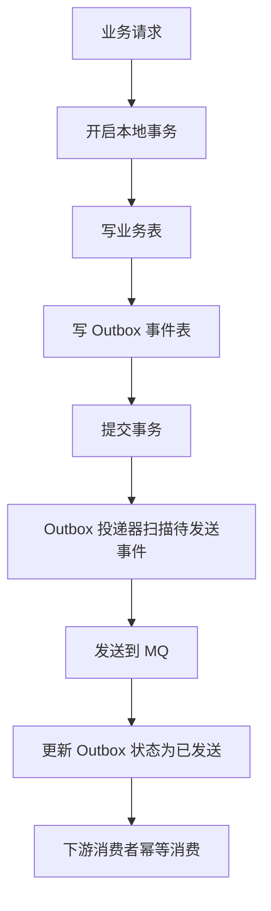

# Outbox 本地消息表设计实战

## 适合人群

- 正在设计订单、支付、库存、通知等跨服务一致性链路的后端工程师
- 想把“库里改状态 + 发 MQ”升级成可恢复方案的开发者
- 准备系统设计面试或做交易链路架构评审的人

## 学习目标

- 理解为什么“写库成功但消息没发出去”是经典一致性问题
- 掌握 Outbox 模式的核心流程、表结构与投递策略
- 能把 Outbox 和幂等、补偿、状态机串成完整闭环

## 快速导航

- [为什么需要 Outbox](#为什么需要-outbox)
- [最常见的问题：写库和发消息不是一个原子动作](#最常见的问题写库和发消息不是一个原子动作)
- [Outbox 到底是什么](#outbox-到底是什么)
- [核心流程怎么走](#核心流程怎么走)
- [表结构怎么设计](#表结构怎么设计)
- [投递器怎么设计](#投递器怎么设计)
- [消费端为什么仍然要幂等](#消费端为什么仍然要幂等)
- [重试、补偿和归档怎么做](#重试补偿和归档怎么做)
- [Outbox 和事务消息、TCC 怎么区分](#outbox-和事务消息tcc-怎么区分)
- [什么时候不一定要用 Outbox](#什么时候不一定要用-outbox)
- [面试回答模板](#面试回答模板)
- [落地检查清单](#落地检查清单)
- [结论](#结论)

## 为什么需要 Outbox

在分布式业务里，有一类操作非常常见：

- 先修改本地数据库
- 再发送一条 MQ 消息给下游

比如：

- 创建订单后发送 `OrderCreated`
- 支付成功后发送 `OrderPaid`
- 订单取消后发送 `OrderCancelled`
- 库存扣减成功后发送 `StockDeducted`

看起来这只是“改库后顺手发个消息”，但问题恰恰就出在这个“顺手”上。

因为数据库事务和消息发送通常不在同一个原子事务里。只要这两步分开，就一定存在中间状态。

## 最常见的问题：写库和发消息不是一个原子动作

最典型的错误写法通常像这样：

```text
1. begin tx
2. insert order
3. commit
4. send MQ message
```

这个流程有一个致命窗口：

- 如果第 3 步提交成功
- 第 4 步因为网络抖动、MQ 故障、进程崩溃而失败

就会出现：

- 数据库里已经有订单
- 下游却完全不知道这件事

于是系统进入“不一致但无人感知”的状态。

反过来，如果你先发消息再提交事务，也会遇到另一个问题：

- 消息已经发出去了
- 但数据库事务最终回滚了

这会导致下游收到一条“根本不存在”的业务事件。

所以核心矛盾非常明确：

> 单机数据库事务无法天然覆盖“发消息”这个外部动作，但业务链路又要求两者最终一致。

## Outbox 到底是什么

Outbox 模式本质上是一种“先把消息当成业务数据一起落库，再异步投递出去”的设计。

它的核心思想是：

- 不直接在主流程里依赖“发 MQ 一定成功”
- 而是在本地事务里把“待发送消息”也写进数据库
- 后续再由独立投递器把这条消息可靠发送出去

所以 Outbox 模式的关键不是“多一张表”，而是：

- 把消息发送问题转化成了数据库里的可恢复任务问题

也就是说，数据库不只是存业务事实，还临时承担了一部分“可靠待投递事件存储”的职责。

## 核心流程怎么走

Outbox 最标准的一条链路可以这样理解：



拆成步骤就是：

1. 业务服务在一个本地事务里同时写两份数据
   - 业务表
   - Outbox 表
2. 事务提交成功，说明：
   - 业务事实已落库
   - 待发送事件也已落库
3. 独立投递器扫描 Outbox 表里的待发送事件
4. 成功发到 MQ 后，把这条记录标记为已发送
5. 如果发送失败，后续继续重试

这就解决了：

- “业务成功了，但消息丢了”时如何恢复

因为只要 Outbox 记录还在，投递器就总能继续把它补发出去。

## 表结构怎么设计

下面是一版比较常见、也比较实用的 Outbox 表结构：

```sql
CREATE TABLE outbox_event (
  id BIGINT PRIMARY KEY AUTO_INCREMENT,
  event_id VARCHAR(64) NOT NULL UNIQUE,
  biz_type VARCHAR(64) NOT NULL,
  biz_key VARCHAR(64) NOT NULL,
  topic VARCHAR(128) NOT NULL,
  payload JSON NOT NULL,
  headers JSON NULL,
  status VARCHAR(16) NOT NULL,
  retry_count INT NOT NULL DEFAULT 0,
  next_retry_time DATETIME NULL,
  last_error VARCHAR(512) NULL,
  created_at DATETIME NOT NULL,
  updated_at DATETIME NOT NULL,
  sent_at DATETIME NULL,
  KEY idx_status_next_retry_time (status, next_retry_time),
  KEY idx_biz_type_biz_key (biz_type, biz_key)
);
```

### 关键字段说明

- `event_id`
  - 全局唯一事件 ID
  - 用于去重和下游幂等追踪
- `biz_type + biz_key`
  - 业务类型和业务主键
  - 例如 `order + order_12345`
- `topic`
  - 投递目标主题
- `payload`
  - 事件内容
- `status`
  - 例如 `NEW / SENDING / SENT / FAILED`
- `retry_count`
  - 记录已重试次数
- `next_retry_time`
  - 用于控制退避重试
- `last_error`
  - 留给排障定位

## 投递器怎么设计

Outbox 的关键不只是写表，还要有一个可靠投递器。

### 1. 最朴素的思路

投递器定期扫描：

```sql
SELECT *
FROM outbox_event
WHERE status IN ('NEW', 'FAILED')
  AND (next_retry_time IS NULL OR next_retry_time <= NOW())
ORDER BY id
LIMIT 100;
```

拿到事件后：

1. 发送到 MQ
2. 成功则更新为 `SENT`
3. 失败则增加 `retry_count`，并设置新的 `next_retry_time`

### 2. 为什么不能多个投递器直接无脑扫同一批数据

如果多实例都在扫，最容易出现的问题是：

- 同一条事件被多个实例同时拿到
- 然后被重复发送到 MQ

这类重复通常不能完全避免，所以工程上一般会做两层保护：

- 扫描时加抢占或状态跃迁
- 下游消费继续做幂等

例如先把记录从 `NEW` 改为 `SENDING`，谁改成功谁拿到处理权。

### 3. 一个更稳的状态流转

比较常见的状态流转是：

- `NEW`
- `SENDING`
- `SENT`
- `FAILED`

其中：

- `NEW`：刚写入，尚未投递
- `SENDING`：某个投递器已抢到，正在投递
- `SENT`：已成功投递
- `FAILED`：投递失败，等待重试

这样做的目的不是绝对杜绝重复，而是：

- 降低并发重复发送概率
- 让排障和恢复状态更清晰

## 消费端为什么仍然要幂等

Outbox 可以显著降低“业务成功但消息没发出去”的问题，但它不能把消息系统变成严格意义上的“只消费一次”。

因为真实系统里仍然会出现：

- 投递成功了，但更新 `SENT` 状态失败
- 网络超时导致发送结果不明确
- MQ 重试导致重复投递
- 下游消费失败后再次投递

所以正确理解应该是：

- Outbox 解决的是“消息最终一定能发出去”
- 但不承诺“下游只会收到一次”

因此消费端仍然必须保证幂等。

最常见做法包括：

- 以 `event_id` 做幂等去重
- 以业务主键 + 动作名做唯一约束
- 继续依赖数据库条件更新

## 重试、补偿和归档怎么做

### 1. 重试

重试建议不要无脑固定间隔，而应该带退避，例如：

- 第 1 次失败：10 秒后
- 第 2 次失败：30 秒后
- 第 3 次失败：2 分钟后
- 第 4 次失败：10 分钟后

这样可以避免下游持续故障时把系统打得更重。

### 2. 补偿

如果一条消息长时间投递失败，通常需要有人工或自动补偿手段：

- 告警
- 管理后台重试
- 定时补偿任务

### 3. 归档

Outbox 表不能无限增长。常见做法包括：

- 已发送数据保留 N 天后归档
- 已完成数据转冷表
- 大批量清理历史 `SENT` 事件

否则 Outbox 表会逐渐成为新的热点和负担。

## Outbox 和事务消息、TCC 怎么区分

这是面试和评审里很容易追问的地方。

### 1. Outbox

核心特点：

- 基于本地事务
- 主业务和待发送消息一起落库
- 后续异步投递

适合：

- 最终一致性链路
- 订单、营销、通知、库存等互联网业务

### 2. 事务消息

核心特点：

- 由消息中间件提供更强的事务协同能力
- 业务方不一定要自己维护 Outbox 表

适合：

- 团队已经成熟使用支持事务消息的中间件
- 想降低自建投递器复杂度

### 3. TCC

核心特点：

- 强业务侵入
- 通过 Try / Confirm / Cancel 显式建模
- 一致性更强，但复杂度也明显更高

适合：

- 资金、核心库存等强一致场景

所以大致可以这样理解：

- `Outbox`：最常见的最终一致性工程方案
- `事务消息`：借助 MQ 能力简化一部分 Outbox 问题
- `TCC`：更强控制力，但复杂度高得多

## 什么时候不一定要用 Outbox

Outbox 很有用，但也不是所有场景都必须引入。

下面几种情况要谨慎：

### 1. 业务根本不需要发消息

如果链路里没有真正的异步事件需求，就不要为了“模式正确”硬加 Outbox。

### 2. 同库内本地事务就能解决

如果只是单服务、单库、多表联动，优先用本地事务，不要过早引入消息一致性方案。

### 3. 中间件已经提供更合适的事务消息能力

如果团队已有成熟事务消息落地，并且配套监控与治理完善，那么没有必要再重复造一套 Outbox。

### 4. 业务规模过小，维护成本反而更高

对于小型系统，Outbox 的收益可能还不如“可接受的简化方案 + 定时补偿”。

## 面试回答模板

如果面试官问“Outbox 模式是什么，为什么要用”，一个比较稳的回答可以这样说：

> Outbox 模式主要解决的是本地数据库事务和消息发送不是一个原子动作的问题。  
> 比如订单创建成功后要发一条消息给下游，如果数据库提交成功了，但发 MQ 失败，就会出现业务数据和消息链路不一致。  
> Outbox 的做法是在一个本地事务里同时写业务表和 Outbox 表，事务提交后由独立投递器去扫描 Outbox 记录并发送 MQ。这样即使服务当时崩溃，后面也还能根据 Outbox 记录继续补发。  
> 它本质上是把“发消息”转换成了一个数据库里可恢复的待处理任务。  
> 当然 Outbox 也不能替代消费端幂等，因为投递和消费链路里仍然可能出现重复消息，所以最终还是要和幂等、补偿、状态机一起使用。

如果继续追问，可以顺着讲：

1. 为什么不能简单地“提交后直接发消息”
2. 投递器如何避免多实例重复处理
3. 为什么 Outbox 解决不了消费端重复消费
4. Outbox 和事务消息、TCC 的边界差异

## 落地检查清单

### 1. 事务边界

- 业务表和 Outbox 表是否在同一个本地事务里提交
- 是否避免了“业务成功后再临时补写 Outbox”

### 2. 表设计

- 是否有 `event_id` 唯一约束
- 是否有状态字段、重试次数、下次重试时间
- 是否有便于扫描的索引

### 3. 投递器

- 是否支持多实例安全抢占
- 是否有失败退避重试
- 是否有投递失败告警

### 4. 消费幂等

- 下游是否以 `event_id` 或业务键做幂等
- 是否假设 MQ 会天然保证 exactly once

### 5. 生命周期治理

- 是否有已发送事件归档清理策略
- 是否有异常消息人工介入方案
- 是否有链路指标和审计日志

## 结论

Outbox 模式的核心价值，不是“多建一张表”，而是：

- 把消息发送从一次脆弱的即时动作
- 变成一个可恢复、可重试、可观测的本地持久化过程

所以它最值得记住的一句话是：

> Outbox 不是为了让消息一次就发成功，而是为了让“消息最终能发出去”这件事变得可恢复、可补偿、可治理。

## 相关阅读

- [分布式事务方案对比](/architecture/distributed-transaction-comparison)
- [库存扣减与订单创建一致性设计](/architecture/order-and-inventory-consistency-design)
- [订单状态机设计实战](/architecture/order-state-machine-design)
- [订单超时取消与时间轮设计](/architecture/order-timeout-cancellation-and-timing-wheel)
- [延时任务方案对比](/architecture/delayed-task-solution-comparison)
