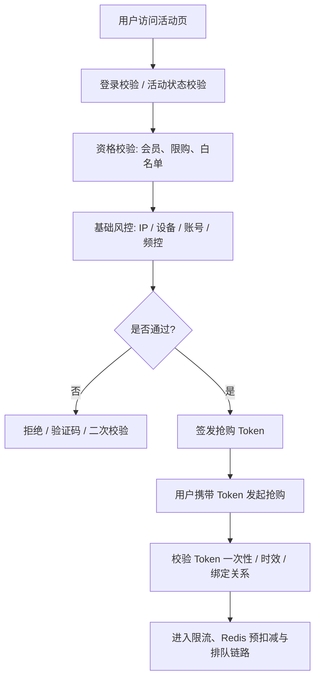

# 秒杀系统风控、防刷与资格校验设计

## 适合人群

- 需要设计秒杀、抢券、预约抢购等高并发活动入口链路的后端工程师
- 想把“限流”和“资格过滤”继续往前推进到风控治理层的开发者
- 准备系统设计面试、活动评审或大促保障的人

## 学习目标

- 理解为什么很多秒杀系统真正的损耗，来自脚本、重放和无效流量，而不只是库存热点
- 掌握资格校验、抢购 Token、设备/IP/账号维度风控和误杀恢复之间的关系
- 能设计一条兼顾用户体验、稳定性和拦截效果的活动入口治理链路

## 快速导航

- [为什么秒杀系统一定要做风控和资格治理](#为什么秒杀系统一定要做风控和资格治理)
- [先把资格问题和风控问题分开](#先把资格问题和风控问题分开)
- [秒杀入口治理的总体目标](#秒杀入口治理的总体目标)
- [一条推荐的入口治理链路](#一条推荐的入口治理链路)
- [第一层：活动资格前置准备](#第一层活动资格前置准备)
- [第二层：抢购 Token 和一次性凭证](#第二层抢购-token-和一次性凭证)
- [第三层：用户、设备和 IP 维度的基础风控](#第三层用户设备和-ip-维度的基础风控)
- [第四层：行为识别和动态规则](#第四层行为识别和动态规则)
- [第五层：黑白名单与人工兜底](#第五层黑白名单与人工兜底)
- [第六层：误杀恢复与审计追踪](#第六层误杀恢复与审计追踪)
- [常见误区](#常见误区)
- [面试回答模板](#面试回答模板)
- [落地检查清单](#落地检查清单)
- [结论](#结论)

## 为什么秒杀系统一定要做风控和资格治理

很多团队第一次做秒杀时，容易把注意力都放在：

- 库存怎么扣
- Redis 怎么扛流量
- MQ 怎么削峰

这些当然重要，但真实线上里还有一类成本经常被低估：

- 大量根本不该进入主链路的请求
- 机器脚本批量刷接口
- 抢购链接被重放
- 一个用户用多个账号、多个设备重复打活动

如果这些流量没有在入口阶段被处理掉，就会出现几个后果：

- 合法用户请求被垃圾流量淹没
- Redis 热 Key 和限流器被白白消耗
- 队列和数据库承接了大量无意义请求
- 活动结果看似没超卖，但成功率和体验很差

所以秒杀系统里非常值得记住的一句话是：

> 库存系统决定“卖给谁”，而风控与资格治理决定“谁有机会参与这场分配”。

## 先把资格问题和风控问题分开

这两个词经常一起出现，但它们解决的并不是同一个问题。

### 资格校验更偏业务规则

例如：

- 用户是否登录
- 是否是会员或新用户
- 是否命中活动白名单
- 是否超过单人限购次数
- 是否已经中过券或抢到过商品

这里的核心问题是：

- 这个用户按活动规则，是否有资格参与

### 风控更偏风险拦截

例如：

- 同一设备短时间切多个账号抢购
- 同一 IP 高频打接口
- 请求轨迹明显像脚本而不是正常点击
- 某些账号、设备、收货地址关联异常

这里的核心问题是：

- 这个请求是不是异常、作弊或高风险行为

### 为什么要分清

因为如果两者混在一起，很容易出现两个问题：

- 业务规则变更时要改整套风控逻辑
- 风控误杀时用户投诉也很难解释和回溯

更成熟的做法通常是：

- `资格校验` 负责业务准入
- `风控系统` 负责风险拦截
- `最终令牌发放` 负责把结果收口成一条可执行决策

## 秒杀入口治理的总体目标

一个更成熟的秒杀入口治理方案，通常同时追求这些目标：

- 尽量早拦截无资格和高风险请求
- 不让抢购接口长期暴露为可重放入口
- 尽量减少合法用户被误伤
- 把复杂规则和主链路性能隔离开
- 为后续限流、库存扣减和异步下单减压

这里有个很现实的工程原则：

- 风控不是做得越重越好
- 而是要在拦截效果、时延和误杀率之间找到平衡

## 一条推荐的入口治理链路

比较典型的秒杀入口治理链路，可以这样理解：

这条链路的关键点在于：

- 不让所有请求直接进入库存层
- 不让抢购接口成为可无限重放的裸接口
- 把高风险识别放到资格放行之前
- 把最终是否进入秒杀主链路，收敛成一个明确令牌决策

## 第一层：活动资格前置准备

资格校验尽量不要等到请求真正冲进秒杀接口时才临时查很多数据。

更稳的做法通常是提前准备活动资格数据。

### 常见资格数据

- 活动白名单
- 会员等级或用户标签
- 单人限购上限
- 已参与次数
- 历史命中记录

### 为什么要前置准备

因为秒杀开始时，资格接口如果还需要实时联查多个系统，很容易出现：

- RT 飙升
- 下游接口被打爆
- 资格查询本身变成新的瓶颈

所以常见做法是：

- 活动开始前把关键资格数据预热到 Redis 或本地缓存
- 对不那么实时的数据，接受分钟级同步延迟
- 对强实时规则，只保留极少数关键校验在主链路上

### 一个工程取舍

不是所有资格规则都要同步判断。

通常应该把规则拆成两类：

- `必须当场拦截的规则`
- `允许事后校验和补偿的规则`

主链路只保留第一类，避免把资格校验做成一个高延迟规则引擎。

## 第二层：抢购 Token 和一次性凭证

很多秒杀系统即使做了登录校验，仍然会被脚本反复重放请求。

所以一个非常实用的设计是：

- 不让用户直接请求最终抢购接口
- 而是先换取一个短期有效的抢购 Token

### 抢购 Token 主要解决什么

- 防止接口地址被长期裸露调用
- 防止用户反复伪造参数重放请求
- 把资格校验结果和真正抢购动作绑定起来

### 设计要点

抢购 Token 通常建议包含：

- 用户 ID
- 活动 ID
- SKU ID
- 签发时间
- 过期时间
- 随机 nonce

同时还要注意：

- Token 最好有很短的 TTL
- Token 最好和用户、活动、SKU 绑定
- Token 最好只允许消费一次或有限次消费
- Token 校验失败时不要暴露太多细节

### Token 不等于风控全部完成

要注意，Token 只是入口闸门，不是全部安全能力。

它更像是在说：

- 这个请求在某个时间窗口内，被系统允许尝试一次抢购

后面的限流、库存预扣减、排队和回补仍然要正常存在。

## 第三层：用户、设备和 IP 维度的基础风控

秒杀风控里最先落地的一层，通常不是复杂模型，而是基础规则。

### 最常见的维度

- 用户维度：账号年龄、历史参与次数、失败次数
- 设备维度：设备指纹、设备关联账号数
- IP 维度：同 IP 请求频率、同网段聚集情况
- 地址维度：同收货地址绑定多个账号

### 基础风控为什么重要

因为很多明显异常流量，其实不需要复杂机器学习就能识别。

例如：

- 1 分钟内同 IP 请求几千次
- 一个设备在几秒内切换大量账号
- 一个地址在活动开始瞬间同时发起多笔抢购

这类请求如果还继续放到库存层，本质上是在浪费主链路资源。

### 常见处理动作

- 直接拒绝
- 要求验证码或二次验证
- 降低该维度的放行速率
- 进入人工审核或观察名单

## 第四层：行为识别和动态规则

基础规则能挡住很多问题，但在热点活动里，脚本方也会快速调整策略。

这时候通常还需要加入行为识别能力。

### 可观察的行为特征

- 页面停留时间是否异常短
- 点击路径是否符合正常用户操作
- 请求间隔是否高度规律化
- 是否绕过前置页面直接命中抢购接口
- 是否持续命中边缘时间点反复重试

### 为什么动态规则更稳

因为热点活动中，风险模式会随着活动推进而变化：

- 活动开始前，主要是探测和预刷
- 活动开始瞬间，主要是洪峰和脚本并发
- 活动中后期，主要是重试风暴和批量捡漏

如果规则是完全静态的，很容易：

- 活动前挡不住
- 活动中误伤大
- 活动后没有及时收缩

所以很多成熟系统会做：

- 规则动态下发
- 不同活动使用不同阈值
- 根据实时指标自动切换校验强度

## 第五层：黑白名单与人工兜底

风控系统不是百分之百准确的，所以一定要有人工可干预能力。

### 白名单常见用途

- 保障核心用户、测试账号、内部演练账号
- 活动灰度放量
- 关键投诉用户快速恢复

### 黑名单常见用途

- 已确认作弊账号或设备
- 已确认恶意 IP 段
- 明确违规的地址或行为特征

### 为什么这一层重要

因为活动现场往往变化很快。

你不可能每次都等研发发版才能：

- 放开一批用户
- 封禁一批异常设备
- 调整某个维度阈值

所以风控体系最好具备：

- 控制台配置
- 快速生效
- 可回滚
- 审计记录

## 第六层：误杀恢复与审计追踪

风控系统最容易被忽略的一点是：

- 拦得住不代表就设计完了

因为一旦误伤合法用户，影响的通常是：

- 活动口碑
- 客诉压力
- 用户对平台公平性的信任

### 至少要有的能力

- 记录每次拦截命中的规则和证据
- 能区分资格不通过和风控拦截
- 能支持人工申诉或快速恢复
- 能回溯某次活动中某个用户为什么被拒绝

### 为什么审计很关键

如果系统只能返回：

- 抢购失败

那业务、客服和研发后面几乎无法判断：

- 是没资格
- 是命中限购
- 是 Token 失效
- 还是被风控拦截

可解释性越弱，现场处置成本越高。

## 常见误区

### 1. 误区一：限流做了，风控就可以省略

不能这样看。

限流保护的是系统资源，风控保护的是活动公平性和有效资源分配。

### 2. 误区二：验证码一上就万事大吉

验证码能挡住一部分脚本，但会明显影响转化，也挡不住所有自动化工具。

### 3. 误区三：风控规则越多越好

规则太重、链路太长，很容易把主链路时延抬高，或者把误杀率拉上去。

### 4. 误区四：资格规则和风控规则混在一起维护

这样会让业务变更、风控调优和问题排查全都变得很重。

### 5. 误区五：只拦截，不留证据

没有审计和恢复能力的风控系统，线上一旦误伤，就很难快速修复。

## 面试回答模板

如果面试官问“秒杀系统怎么做风控和资格校验”，可以用下面这版口径回答：

> 我会把资格校验和风控拆开来看。资格校验解决的是用户按活动规则能不能参与，比如会员等级、白名单、限购次数；风控解决的是这个请求是不是异常、作弊或高风险流量。  
> 工程上我一般会先把关键资格数据在活动开始前预热到 Redis，然后在用户真正请求抢购前，先做登录、活动状态、限购等资格判断，再做 IP、设备、账号维度的基础风控。通过之后，系统再签发一个短期有效、和用户及活动绑定的一次性抢购 Token。  
> 用户携带 Token 发起最终请求时，再校验 Token 的时效、绑定关系和消费次数，只有通过后才进入限流、Redis 预扣减和异步排队链路。对于高风险但不确定的流量，我会优先走验证码、二次校验或降速，而不是简单粗暴全部拒绝。  
> 同时我会保留黑白名单、规则动态开关和审计追踪能力，因为秒杀现场变化很快，风控不仅要能拦，还要能解释、能恢复、能快速调参。

如果继续追问，可以顺着讲：

1. 资格校验和风控分别负责什么
2. 抢购 Token 为什么有必要
3. 设备/IP/账号维度规则怎么设计
4. 风控误杀后怎么恢复
5. 风控如何和限流、库存扣减链路配合

## 落地检查清单

### 1. 资格准备

- 是否提前准备活动白名单、限购次数和用户标签
- 是否把高频资格数据预热到 Redis 或本地缓存
- 是否把资格规则拆成同步必查和可事后校验两类

### 2. 抢购 Token

- 是否通过短期 Token 隐藏最终抢购入口
- Token 是否绑定用户、活动和 SKU
- Token 是否具备 TTL、nonce 和一次性消费控制

### 3. 基础风控

- 是否按用户、设备、IP、地址等多维度识别风险
- 是否有限频、黑名单、二次验证等基础动作
- 是否避免把明显异常流量放进库存层

### 4. 动态治理

- 是否支持活动维度动态调整规则和阈值
- 是否支持黑白名单和配置快速生效
- 是否支持按风险等级做不同处置动作

### 5. 可解释性与恢复

- 是否记录拦截原因和命中规则
- 是否支持客服和运营排查被拒原因
- 是否有误杀恢复和人工兜底流程

## 结论

秒杀系统风控、防刷与资格校验真正要解决的，不只是“多挡掉一点请求”，而是：

- 让无资格和高风险流量尽早出局
- 让真正有资格的用户更公平地进入主链路
- 让抢购接口不成为可以长期重放的裸入口
- 让现场风控具备可调、可解释、可恢复能力

所以最值得记住的一句话是：

> 秒杀入口治理的本质，不是简单拦请求，而是把业务资格、风险识别和令牌放行收敛成一套可解释、可调节的准入机制。

## 相关阅读

- [大促活动预热、压测与开关治理手册](/architecture/promotion-readiness-pressure-test-and-switch-governance)
- [秒杀系统限流、削峰与降级设计](/architecture/seckill-system-rate-limiting-and-degradation)
- [秒杀系统库存设计专题](/architecture/seckill-system-inventory-design)
- [秒杀结果查询、排队态与用户体验设计](/architecture/seckill-result-query-and-queueing-ux-design)
- [高并发系统设计清单](/architecture/high-concurrency-system-checklist)
- [Redis 高并发、集群与锁](/redis/high-concurrency-cluster-locks)
