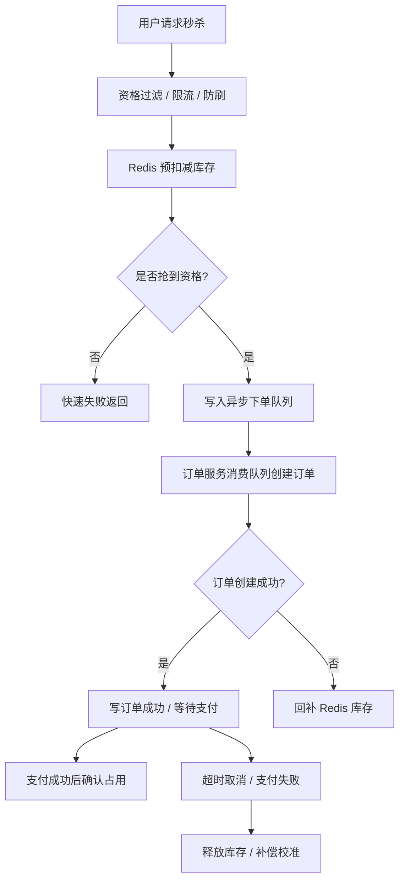

# 秒杀系统库存设计专题

## 适合人群

- 需要设计秒杀、抢购、限量券等高并发活动系统的后端工程师
- 想把普通库存扣减方案升级成“抗热点、抗峰值”的开发者
- 准备高并发系统设计面试或活动架构评审的人

## 学习目标

- 理解为什么秒杀库存问题比普通交易库存问题更难
- 掌握资格过滤、Redis 预扣减、异步下单和回补补偿之间的关系
- 能设计一条更适合高峰流量场景的秒杀库存链路

## 快速导航

- [为什么秒杀库存问题和普通下单不一样](#为什么秒杀库存问题和普通下单不一样)
- [先明确秒杀系统真正要扛的是什么](#先明确秒杀系统真正要扛的是什么)
- [秒杀库存设计的总体目标](#秒杀库存设计的总体目标)
- [一条推荐的秒杀链路](#一条推荐的秒杀链路)
- [第一层：先挡掉不该进来的流量](#第一层先挡掉不该进来的流量)
- [第二层：用 Redis 做预扣减](#第二层用-redis-做预扣减)
- [第三层：异步下单而不是同步打库](#第三层异步下单而不是同步打库)
- [热点库存怎么打散](#热点库存怎么打散)
- [为什么还要回源数据库校准](#为什么还要回源数据库校准)
- [下单失败或超时怎么回补库存](#下单失败或超时怎么回补库存)
- [常见误区](#常见误区)
- [面试回答模板](#面试回答模板)
- [落地检查清单](#落地检查清单)
- [结论](#结论)

## 为什么秒杀库存问题和普通下单不一样

普通电商库存问题已经不简单，但秒杀场景会把所有问题一起放大：

- 流量极端集中
- 商品热点极强
- 用户请求短时间爆发
- 大量请求天然无效
- 业务容忍度通常更低

例如一场秒杀里，可能会出现：

- 1 个 SKU
- 1000 件库存
- 几十万甚至上百万请求在几秒内打进来

如果你还按普通链路去做：

- 查库存
- 扣库存
- 写订单
- 同步返回

很快就会出现：

- 数据库热点行打爆
- Redis 热 Key 被打满
- 大量无效请求把系统压垮
- 最终库存状态和订单状态不一致

所以秒杀系统库存设计的关键，不只是“别超卖”，而是：

> 在极端热点流量下，让有限库存以尽量低成本、尽量高成功率、尽量可恢复的方式被正确分配出去。

## 先明确秒杀系统真正要扛的是什么

秒杀设计经常容易一上来就讨论：

- 库存怎么扣？

但更应该先明确的是，秒杀系统真正要处理至少四类压力：

- `入口压力`
  - 请求太多，很多人根本没有资格进来
- `库存压力`
  - 同一个 SKU 极度热点
- `订单压力`
  - 真正抢到资格的人也不能全同步打数据库
- `恢复压力`
  - 失败、超时、重复请求、回补都必须可收敛

如果只解决其中一个，系统仍然会在别的地方崩掉。

## 秒杀库存设计的总体目标

一个更成熟的秒杀库存方案，通常同时追求下面这些目标：

- 不超卖
- 不被热点行打爆
- 尽量快地拒绝无效请求
- 尽量异步化主链路
- 下单失败后能补回库存
- 活动结束后能做账实校准

这里有一个很重要的认知：

- 秒杀系统不一定追求“每一步都强一致”
- 但一定追求“最终收敛且不会资损”

## 一条推荐的秒杀链路

比较典型的秒杀库存链路可以这样理解：

这条链路的关键点是：

- 热点库存不在第一时间直接压数据库
- 大部分无效请求在入口或 Redis 层就被挡掉
- 只有少量“抢到资格”的请求才进入异步下单阶段
- 订单失败和超时取消都要有回补和校准机制

## 第一层：先挡掉不该进来的流量

秒杀系统的一个共识是：

- 不是每个请求都值得进入库存扣减逻辑

所以第一层通常会做资格过滤。

### 常见过滤项

- 用户是否登录
- 用户是否有活动资格
- 是否超过单人限购次数
- 是否命中风控规则
- 是否重复请求

### 为什么这一层重要

因为很多请求其实从业务上就不应该进入秒杀主链路。

越早挡掉它们：

- 后面库存层压力越小
- 异步队列越干净
- 数据库越安全

在极端场景下，这一层的价值甚至比“库存怎么扣”还大。

## 第二层：用 Redis 做预扣减

秒杀里最常见的一步是：

- 不先打数据库
- 先在 Redis 里做库存预扣减

原因非常现实：

- Redis 更适合承接高频热点读写
- 单线程原子操作更适合做快速资格判定

### 一个常见模型

Redis 中维护：

- `seckill:stock:{sku_id}`
- `seckill:user:{activity_id}:{user_id}`

处理逻辑通常是：

1. 先检查用户是否已抢过
2. 再检查库存是否大于 0
3. 原子扣减库存
4. 记录用户已抢资格

这类逻辑一般适合放进 Lua 脚本里原子执行。

### 为什么这里说“预扣减”

因为这一步通常并不意味着：

- 订单一定已经创建成功

更准确地说，它代表：

- 这个请求已经抢到“继续往后走”的资格

所以 Redis 预扣减本质上是：

- 资格分配
- 热点拦截
- 快速减压

而不是最终业务落账。

## 第三层：异步下单而不是同步打库

秒杀系统里非常重要的一条经验是：

> Redis 扣减成功后，不应该立刻把所有请求同步打到订单数据库。

因为这样会把热点从 Redis 转移到订单库、库存库、支付库，最后整条链路一起抖。

更稳妥的方式通常是：

- Redis 预扣减成功
- 只返回“抢购资格已拿到”或“排队中”
- 然后写入 MQ / 队列
- 后台 worker 异步创建订单

### 这样做的价值

- 把峰值请求变成可消费队列
- 限制数据库并发写入速度
- 更容易做失败重试和补偿

所以秒杀场景里，“异步下单”往往比“同步成功返回订单结果”更稳。

## 热点库存怎么打散

即使库存先放在 Redis，热点问题也不会自动消失。

一个超级热点 SKU 仍然可能把某个 Key 打成瓶颈。

### 常见打散方式

#### 1. 库存分桶

把同一个商品库存拆成多个桶：

- `stock:sku:1001:bucket:1`
- `stock:sku:1001:bucket:2`
- `stock:sku:1001:bucket:3`

请求进入时随机或按规则落到某个桶，减少单 Key 热点。

#### 2. 请求打散

通过网关、队列、工作线程池，把突发请求均匀铺开。

#### 3. 分层限流

在：

- 网关层
- 活动服务层
- Redis 扣减层
- 异步消费层

分别限流，避免某一层瞬时被打穿。

### 但要注意

热点打散的代价通常是：

- 统计更复杂
- 回补更复杂
- 账实校准更复杂

所以不能为了“更炫的架构”盲目分桶，必须根据压力级别来决定。

## 为什么还要回源数据库校准

秒杀库存如果完全只靠 Redis，是不够的。

因为 Redis 更适合做：

- 高速资格控制
- 热点削峰

但最终业务真相仍然通常要落到数据库里，例如：

- 最终订单是否创建成功
- 最终库存是否真的被占用
- 超时取消后是否真的释放

所以成熟系统通常会保留一条“账实校准”主线：

- Redis 负责快
- 数据库负责准

活动结束后，或者在运行中周期性地，都需要去校准：

- Redis 预扣减数
- 成功订单数
- 取消回补数
- 实际库存余量

## 下单失败或超时怎么回补库存

这是秒杀系统里最容易出事故的地方之一。

### 常见回补场景

- Redis 预扣减成功，但订单创建失败
- 订单创建成功，但支付超时取消
- 订单创建成功，但后续链路异常需要关闭

### 回补原则

- 回补必须幂等
- 回补必须可重试
- 回补最好事件化

比较稳妥的做法通常是：

- 订单创建失败 -> 发 `OrderCreateFailed` 事件 -> 回补库存
- 订单超时取消 -> 发 `OrderCancelled` 事件 -> 回补库存
- 活动结束后再跑兜底校准任务

这里和普通库存系统的共同点是：

- 最终都需要补偿收敛

不同点在于秒杀系统更强调：

- 高峰下先快分配资格
- 事后再持续校准

## 常见误区

### 1. 误区一：秒杀库存只要放 Redis 就够了

不够。

Redis 只能帮你解决热点和快速资格分配问题，最终业务状态仍然要靠订单、数据库和补偿去收口。

### 2. 误区二：只要异步下单，就天然不会超卖

不对。

异步下单只是削峰，不替代库存原子扣减和回补设计。

### 3. 误区三：秒杀系统只看成功率，不看回补

如果失败链路和回补没设计好，活动结束后很容易出现：

- 账实对不上
- 库存被吞
- 用户资格错误

### 4. 误区四：所有场景都要做复杂分桶

热点分桶有价值，但也有代价。不是所有秒杀系统都必须一上来就做最复杂的拆分。

### 5. 误区五：只有秒杀前半段重要

很多系统只关注：

- 用户能不能抢到

但真正的线上问题往往出在后半段：

- 订单没创建
- 库存没回补
- 支付超时没释放

## 面试回答模板

如果面试官问“秒杀库存怎么设计”，可以用下面这版口径来回答：

> 秒杀库存设计和普通下单最大的区别在于流量极度集中、热点 SKU 极强，所以我不会让所有请求直接打数据库。  
> 通常我会分三层处理：第一层做资格过滤、限流和防刷，把明显无效请求挡在外面；第二层用 Redis 做预扣减库存，最好通过 Lua 脚本原子判断库存和用户资格；第三层把抢到资格的请求写入异步队列，由后台 worker 慢慢创建订单。  
> 这样做的核心目的是把热点库存从数据库前移到 Redis，把同步写库流量削成可消费队列。  
> 但 Redis 预扣减不等于最终业务完成，所以订单创建失败、支付超时取消时都必须有库存回补，而且活动结束后还要有账实校准任务。  
> 所以秒杀库存设计的关键不只是防超卖，还包括热点打散、异步削峰、失败回补和最终校准。

如果继续追问，可以顺着讲：

1. 为什么不能直接查库扣库存
2. 为什么 Redis 扣减只是预占，不是最终真相
3. 异步下单如何削峰
4. 下单失败和超时取消如何回补库存
5. 热点 SKU 什么时候需要分桶

## 落地检查清单

### 1. 入口治理

- 是否做了资格过滤
- 是否有限流、防刷、重复请求治理
- 是否把明显无效流量挡在库存层之前

### 2. 库存预扣减

- 是否通过原子脚本处理库存和用户资格
- 是否明确 Redis 预扣减只是资格分配，不是最终落账
- 是否定义了库存不足和重复抢购的返回语义

### 3. 异步化

- 是否通过 MQ / 队列异步创建订单
- 是否限制了后台 worker 的消费速率
- 是否避免同步把流量打爆数据库

### 4. 热点治理

- 是否识别热点 SKU
- 是否需要分桶库存或请求打散
- 是否有多层限流和线程池隔离

### 5. 回补与校准

- 订单创建失败是否回补库存
- 超时取消是否回补库存
- 是否有活动后账实校准任务
- 回补逻辑是否幂等可重试

## 结论

秒杀库存设计真正难的地方，不是“怎么扣掉一件库存”，而是：

- 怎么在极端热点下快速挡掉无效请求
- 怎么把热点从数据库前移出去
- 怎么在异步化后仍然不超卖
- 怎么把失败和超时场景补回来

所以最值得记住的一句话是：

> 秒杀库存设计的本质，是“用 Redis 和异步化抗住峰值，用补偿和校准守住最终一致”。 

## 相关阅读

- [高并发系统设计清单](/architecture/high-concurrency-system-checklist)
- [秒杀系统风控、防刷与资格校验设计](/architecture/seckill-risk-control-and-eligibility-design)
- [库存扣减与订单创建一致性设计](/architecture/order-and-inventory-consistency-design)
- [秒杀系统限流、削峰与降级设计](/architecture/seckill-system-rate-limiting-and-degradation)
- [秒杀结果查询、排队态与用户体验设计](/architecture/seckill-result-query-and-queueing-ux-design)
- [抢券系统设计专题：与秒杀系统的异同](/architecture/coupon-claim-system-design-and-comparison)
- [交易系统一致性设计总览](/architecture/transaction-system-consistency-overview)
- [Redis 高并发、集群与锁](/redis/high-concurrency-cluster-locks)
