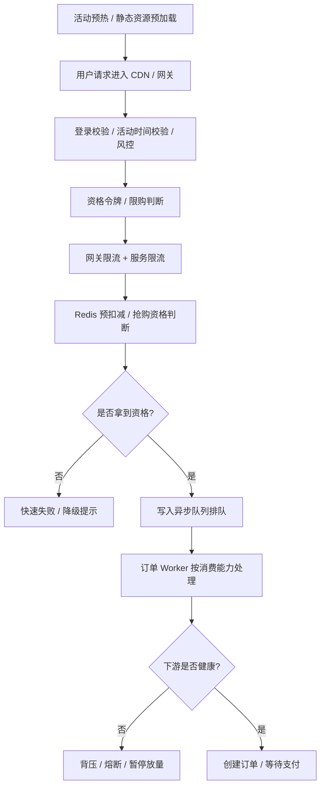

# 秒杀系统限流、削峰与降级设计

## 适合人群

- 需要设计秒杀、抢券、限量活动等高并发入口链路的后端工程师
- 想把“限流”从单点技巧升级成完整稳定性方案的开发者
- 准备系统设计面试、活动架构评审或大促保障的人

## 学习目标

- 理解秒杀系统为什么经常不是先死在库存，而是先死在入口流量和下游背压
- 掌握活动预热、资格过滤、多层限流、异步排队和降级熔断的配合关系
- 能设计一条更适合大促和热点活动的稳定性主链路

## 快速导航

- [为什么秒杀系统经常不是先死在库存，而是先死在流量层](#为什么秒杀系统经常不是先死在库存而是先死在流量层)
- [先把秒杀流量问题分成四类](#先把秒杀流量问题分成四类)
- [秒杀稳定性设计的总体目标](#秒杀稳定性设计的总体目标)
- [一条推荐的稳定性链路](#一条推荐的稳定性链路)
- [第一层：活动预热和静态化](#第一层活动预热和静态化)
- [第二层：资格令牌和前置过滤](#第二层资格令牌和前置过滤)
- [第三层：多层限流而不是只靠一个 Redis 计数器](#第三层多层限流而不是只靠一个-redis-计数器)
- [第四层：排队削峰与异步化](#第四层排队削峰与异步化)
- [第五层：背压、熔断与降级](#第五层背压熔断与降级)
- [第六层：监控指标与容量演练](#第六层监控指标与容量演练)
- [常见误区](#常见误区)
- [面试回答模板](#面试回答模板)
- [落地检查清单](#落地检查清单)
- [结论](#结论)

## 为什么秒杀系统经常不是先死在库存，而是先死在流量层

很多人聊秒杀，一上来就问：

- 库存怎么扣？

但线上真实的崩溃顺序通常不是这样。

一个热点活动真正先被打爆的，往往是下面这些位置：

- 活动页和商品详情页
- 网关层和活动服务入口
- Redis 热 Key
- 异步下单队列
- 订单库、库存库、支付服务

也就是说，秒杀设计里一个很重要的认知是：

> 库存正确性解决的是“不能卖错”，而限流、削峰与降级解决的是“系统不能先死”。

如果入口流量治理没做好，即使你的库存扣减逻辑完全正确，系统也可能在真正扣库存之前就被压垮。

## 先把秒杀流量问题分成四类

秒杀流量不是一个单一问题，至少要拆成下面四类看。

### 1. 入口爆发流量

典型表现：

- 某一秒几十万请求同时进入
- 大量请求集中打在同一个活动、同一个 SKU

这类问题更关注：

- 网关限流
- 活动页静态化
- 热点资源预热

### 2. 业务无效流量

例如：

- 没登录用户
- 没资格用户
- 已经买过的用户
- 活动未开始或已结束的请求

这类流量不该进入库存和下单层，应该尽量前置拒绝。

### 3. 恶意或异常流量

例如：

- 脚本刷请求
- 机器批量抢购
- 重放请求
- 异常重试风暴

这类问题更关注：

- 风控
- 验签或验证码
- 设备指纹
- 请求去重

### 4. 下游背压流量

即使前面都扛住了，后面仍然可能出现：

- MQ 堆积
- 订单服务消费不过来
- 库存回源校准任务堆积
- 支付链路高峰抖动

这类问题的关键不是“再放更多请求进来”，而是：

- 排队
- 背压
- 降级
- 限制承诺量

## 秒杀稳定性设计的总体目标

一个更成熟的秒杀稳定性方案，通常同时追求这些目标：

- 让热点流量尽量晚接触核心资源
- 尽量早拒绝无资格和无意义请求
- 把瞬时峰值改造成可消费的平滑流量
- 当下游扛不住时，能主动降级和收缩承诺
- 即使 Redis、MQ 或订单服务抖动，也不会整体雪崩

这里很值得强调一句：

- 秒杀系统不是“尽量多放请求进去”
- 秒杀系统是“只让系统能处理的那部分请求走完链路”

## 一条推荐的稳定性链路

一条比较稳妥的秒杀稳定性链路可以理解成这样：

这个链路的核心不是某一个技术点，而是把稳定性拆成几道闸门：

- 前面负责挡流量
- 中间负责控资格
- 后面负责削峰和背压
- 最后负责降级和收缩风险

## 第一层：活动预热和静态化

秒杀系统第一层治理，通常不是 Redis，而是活动预热。

### 典型动作

- 活动页静态化
- 商品详情静态化或半静态化
- CDN 预热热点资源
- 把活动开始时间、库存展示、限购规则提前加载到缓存
- 提前建立 Redis 热 Key、库存 Key、用户资格数据

### 为什么这一层值钱

因为如果活动一开始，大量请求先去打：

- 动态渲染
- 商品详情接口
- 配置查询接口

那库存系统还没出场，前面页面层和网关层就先抖了。

所以秒杀稳定性设计很讲究：

- 把活动前能准备的都提前准备好
- 把活动开始时的实时计算降到最低

### 一个实践经验

活动真正开始的那一秒，最贵的资源不应该花在：

- 拼页面
- 查配置
- 查活动规则

而应该优先留给：

- 资格判断
- 限流控制
- 库存资格分配

## 第二层：资格令牌和前置过滤

秒杀系统不能让每个用户都直接冲向库存扣减。

更稳的做法通常是先做资格控制。

### 前置过滤常见项

- 是否登录
- 活动是否开始
- 用户是否命中黑名单或风控规则
- 是否已经参加过活动
- 是否达到单人限购阈值

### 资格令牌的作用

很多系统会在正式进入库存扣减前，再增加一层资格令牌或抢购 Token。

它解决的不是库存问题，而是：

- 防止请求伪造
- 防止用户反复重放
- 控制谁有资格进入真正的抢购主链路

### 令牌设计要点

- 要带活动维度和用户维度
- 要有较短 TTL
- 最好和用户身份、活动时间窗口绑定
- 最好一次性消费或有限次消费

如果没有这一层，接口可能会被脚本长期重放，系统明明库存已经空了，入口仍然在承接大量无意义请求。

## 第三层：多层限流而不是只靠一个 Redis 计数器

很多团队第一次做秒杀，会说：

- 我们上个 Redis 限流就行了

这往往不够，因为秒杀链路里不同层的资源瓶颈不一样。

更靠谱的做法是多层限流。

### 常见限流层次

#### 1. CDN / 网关层

负责挡掉最前面的暴涨流量。

常见手段：

- IP 维度限流
- URI 维度限流
- 用户维度限流
- 活动维度限流

#### 2. 活动服务层

负责更细粒度的业务限流。

例如：

- 单用户每秒请求数
- 单活动总放行速率
- 单 SKU 放行速率

#### 3. Redis / 资格层

负责限制真正进入库存争抢逻辑的请求量。

这里的限流更接近：

- 资格门票发放速度
- 允许参与排队的人数

#### 4. 消费层

负责限制订单创建和库存校准的消费速度。

这一步很关键，因为秒杀不是“前面放进多少，后面就必须瞬时处理多少”。

### 为什么要多层限流

因为：

- 网关能保护入口
- 服务层能保护业务线程池
- Redis 层能保护热点 Key
- 消费层能保护数据库和下游服务

如果只在最前面限一次流，后面很容易局部雪崩。

## 第四层：排队削峰与异步化

秒杀的核心设计之一，是把瞬时并发改造成可处理队列。

### 典型做法

- 抢到资格后不直接同步落单
- 先写入 MQ / Stream / 内存队列
- 后台 worker 按能力消费

### 这一步真正解决什么问题

它解决的不是“库存对不对”，而是：

- 把 1 秒钟内的 10 万请求
- 改造成未来几十秒内被逐步处理的任务流

这就是削峰的本质。

### 排队设计要点

- 队列长度要可观测
- 队列积压过长时要触发降级
- worker 并发数不能只看 CPU，还要看数据库和库存服务承受能力
- 订单创建失败要回补资格或库存

### 常见返回语义

秒杀里很多时候最稳的返回不是：

- 你已下单成功

而是：

- 已获得资格，正在排队
- 请稍后查看结果

这能显著降低同步链路压力，也让后端有更大的调度空间。

## 第五层：背压、熔断与降级

真正成熟的秒杀系统，一定允许自己在高压下“少做一点”，而不是硬扛到整体雪崩。

### 什么叫背压

背压的意思是：

- 下游处理不过来时，上游不能继续无限放量

例如：

- MQ 积压严重
- 订单服务错误率升高
- 数据库 RT 急剧上升
- 库存回补任务明显滞后

这时候就应该主动收缩入口放量。

### 常见降级动作

- 暂时关闭活动入口
- 降低每秒放行令牌数
- 只允许已通过资格校验的用户进入
- 页面改成“排队中”或“稍后重试”
- 暂停非核心链路，例如埋点、推荐、消息推送

### 熔断不是为了漂亮，而是为了止血

当某一层已经明显异常时，继续放流量进去只会造成：

- 更多超时
- 更多重试
- 更大的回放风暴

所以秒杀降级最重要的思想是：

> 宁可少承诺，也不要超出系统能兑现的处理能力。

## 第六层：监控指标与容量演练

秒杀不是只靠设计图就能成功的场景。

真正值钱的是：

- 你能不能提前知道瓶颈在哪
- 你能不能在活动前做容量演练
- 你能不能在活动中快速发现异常并收缩策略

### 重点监控指标

- 活动页 QPS、网关 QPS
- 请求通过率、资格命中率、限流拒绝率
- Redis RT、热点 Key 命中率、Lua 失败率
- 队列长度、消费速率、堆积时长
- 订单创建成功率、失败率、平均耗时
- 数据库 RT、线程池使用率、错误率
- 降级开关触发次数和持续时间

### 活动前至少要做什么

- 压测活动页和网关
- 压测 Redis 热 Key 和 Lua 脚本
- 压测消息队列和订单 worker
- 校准各层限流阈值
- 演练异常场景下的降级开关

没有演练的阈值，通常不是真阈值，只是配置文件里的数字。

## 常见误区

### 1. 误区一：限流就是在网关加个 429

不够。

网关限流只能保护最前面，保护不了：

- Redis 热点层
- 订单消费层
- 数据库和下游服务

### 2. 误区二：只要排队就不会崩

不对。

如果队列可以无限堆积，而下游一直处理不过来，问题只是从同步超时变成异步雪崩。

### 3. 误区三：降级等于系统失败

不是。

在秒杀系统里，降级本来就是正常设计的一部分。它不是失败，而是主动收缩风险。

### 4. 误区四：库存扣减正确，就说明秒杀设计已经完成

库存正确只解决了一半问题。

没有入口治理、限流和背压，系统仍然可能先被流量压死。

### 5. 误区五：所有用户都应该实时知道最终结果

很多时候这不是必须的。

在高峰场景里，先给出排队态，再异步确认结果，通常比同步强返回更稳。

## 面试回答模板

如果面试官问“秒杀系统怎么做限流和削峰”，可以用下面这版口径回答：

> 秒杀系统的稳定性问题，通常不是单靠库存扣减解决的，而是要把流量治理做成多道闸门。  
> 我一般会先做活动预热和静态化，尽量减少活动开始瞬间的动态计算；然后做登录、活动时间、风控、限购等前置过滤，再通过抢购 Token 控制谁能进入真正的秒杀主链路。  
> 限流我不会只做一层，而是会在网关层、活动服务层、Redis 资格层和消费层分别控流量，因为每一层保护的资源不一样。  
> 对真正抢到资格的请求，我会通过 MQ 或队列异步下单，把瞬时峰值变成平滑处理流；如果队列积压、订单服务 RT 升高或者数据库扛不住，就会触发背压和降级，降低令牌发放速度，必要时直接返回排队中或稍后重试。  
> 所以秒杀限流和削峰的核心不是把所有请求都接进来，而是只承接系统当前能兑现的那部分请求。

如果继续追问，可以顺着讲：

1. 为什么要静态化和预热
2. 为什么需要资格令牌
3. 多层限流分别保护什么资源
4. 排队削峰如何和异步下单配合
5. 背压和降级触发条件怎么定

## 落地检查清单

### 1. 活动预热

- 活动页是否静态化或半静态化
- 热点配置是否提前加载到缓存
- Redis 热 Key 是否提前预热

### 2. 前置过滤

- 是否校验登录、活动状态、限购规则
- 是否有风控和防刷策略
- 是否通过资格 Token 控制入口

### 3. 多层限流

- 是否在网关、服务层、资格层、消费层分别限流
- 是否按用户、活动、SKU 等不同维度控流
- 是否为不同层设置了独立阈值和开关

### 4. 削峰排队

- 是否通过 MQ / Stream / 队列异步下单
- 是否监控队列积压长度和消费延迟
- 是否限制 worker 并发，避免把压力转嫁到数据库

### 5. 降级与恢复

- 是否定义了明确的背压触发条件
- 是否有降级开关和默认返回文案
- 是否支持活动入口快速收缩和逐步恢复

### 6. 演练与监控

- 是否压测过活动页、Redis、MQ、订单服务
- 是否监控限流拒绝率和资格命中率
- 是否能快速识别 Redis 热 Key、队列积压和数据库 RT 异常

## 结论

秒杀系统限流、削峰与降级真正要解决的，不是“怎么挡住请求”这么简单，而是：

- 怎么把无效流量挡在最前面
- 怎么把有限资格以受控速度发出去
- 怎么把峰值改造成系统可消化的排队流量
- 怎么在下游异常时主动收缩风险

所以最值得记住的一句话是：

> 秒杀稳定性设计的本质，不是无限接流量，而是用预热、限流、排队、背压和降级，把系统承诺控制在可兑现范围内。

## 相关阅读

- [大促活动预热、压测与开关治理手册](/architecture/promotion-readiness-pressure-test-and-switch-governance)
- [秒杀系统压测脚本、容量估算与演练方法论](/architecture/seckill-pressure-testing-capacity-estimation-and-drills)
- [秒杀系统风控、防刷与资格校验设计](/architecture/seckill-risk-control-and-eligibility-design)
- [秒杀系统库存设计专题](/architecture/seckill-system-inventory-design)
- [秒杀结果查询、排队态与用户体验设计](/architecture/seckill-result-query-and-queueing-ux-design)
- [高并发系统设计核心要点](/architecture/high-concurrency-system-design-core-points)
- [交易系统一致性设计总览](/architecture/transaction-system-consistency-overview)
- [Redis 高并发、集群与锁](/redis/high-concurrency-cluster-locks)
