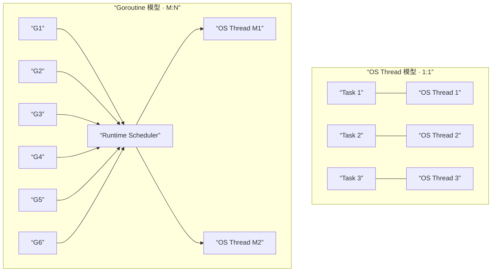
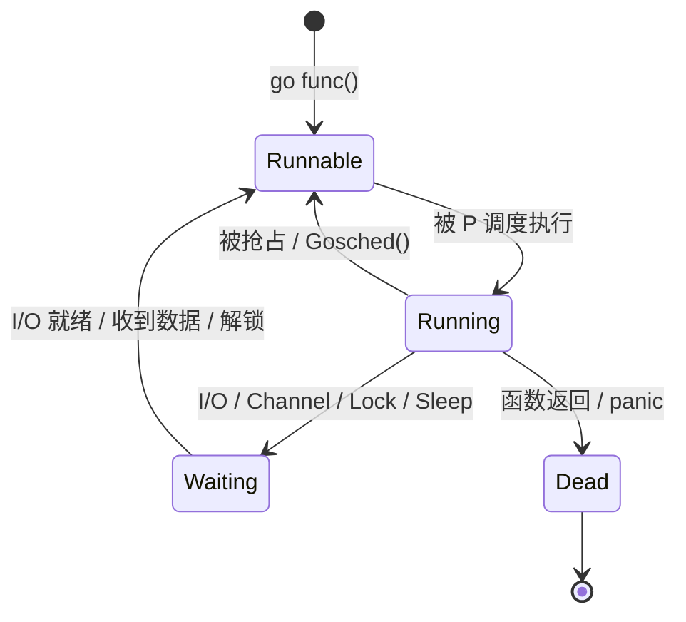
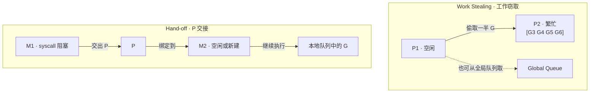
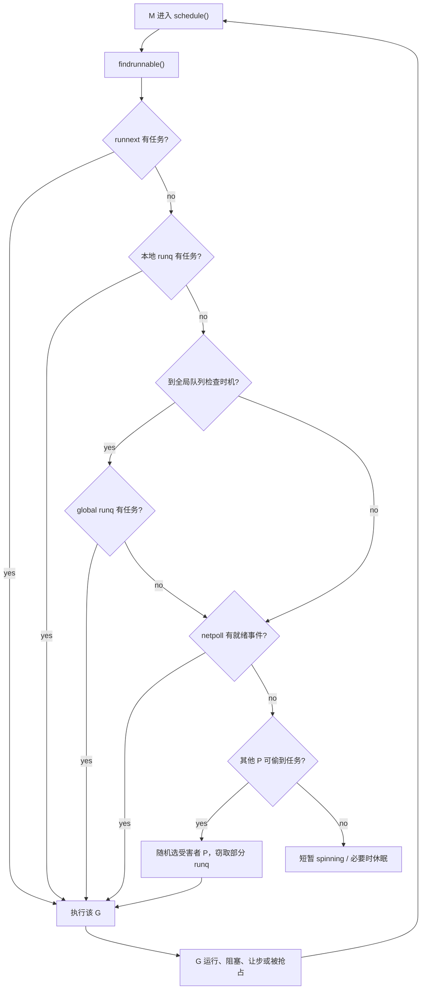

# Goroutine 与 GMP 调度模型

## 1. Goroutine 基础

Goroutine 是 Go 并发的最小执行单元，由 Go runtime 管理，而非操作系统线程。

### Goroutine 与线程的底层差异

Go 提倡“不要通过共享内存来通信，而要通过通信来共享内存”。这套并发哲学之所以可行，关键就在于 Goroutine 不是对 OS 线程的一对一封装，而是由 runtime 在用户态统一调度。

| 特性 | OS 线程（Thread） | Goroutine |
| --- | --- | --- |
| 初始栈 | 通常是 MB 级，具体大小取决于操作系统和运行参数 | 通常从很小的栈开始，按需动态扩缩 |
| 调度者 | 操作系统内核 | Go runtime |
| 切换成本 | 需要内核参与，保存/恢复更多线程上下文 | 大多在用户态完成，切换成本更低 |
| 阻塞影响 | 一个线程阻塞，就会占住一个内核线程 | 一个 Goroutine 阻塞后，runtime 可让线程去执行其他 G |
| 数量级 | 容易受内存和内核资源限制 | 更适合承载海量并发任务 |
| 通信方式 | 常依赖锁、条件变量、共享内存 | 更强调 Channel、Context 和所有权转移 |

从架构视角看，真正重要的不是”Goroutine 更轻”这句结论，而是下面三点：

- **调度权变化**：线程由内核调度，Goroutine 由 runtime 通过 GMP 模型调度，海量任务得以复用在少量线程上。
- **阻塞粒度变化**：在线程模型里，网络/磁盘等待往往直接卡住线程；在 Go 里，很多阻塞只会挂起当前 G，M 仍可继续服务其他请求。
- **编程模型变化**：业务更容易按”任务 + 通信”建模，而不是围绕共享状态、锁竞争和条件变量组织代码。



> 注意：Goroutine 很轻量，但不是”零成本”。如果无上限创建，依然会带来栈内存、调度、GC 和下游资源压力，因此生产代码仍要控制并发度、处理超时并避免泄漏。

### 创建与生命周期

```go
package main

import (
	"fmt"
	"time"
)

func sayHello(name string) {
	fmt.Printf("Hello, %s!\n", name)
}

func main() {
	// 用 go 关键字启动 Goroutine
	go sayHello("World")

	// 匿名函数启动
	go func(msg string) {
		fmt.Println(msg)
	}("anonymous goroutine")

	// main 退出时，所有 Goroutine 被强制终止
	// 这里用 Sleep 只是演示，实际应使用 WaitGroup 或 Channel 同步
	time.Sleep(100 * time.Millisecond)
}
```

### Goroutine 的开销

```go
package main

import (
	"fmt"
	"runtime"
	"sync"
)

func main() {
	var wg sync.WaitGroup
	n := 100_000

	fmt.Printf("启动前 Goroutine 数量: %d\n", runtime.NumGoroutine())

	for i := 0; i < n; i++ {
		wg.Add(1)
		go func() {
			defer wg.Done()
			// 模拟轻量任务
			_ = 1 + 1
			// 让出 CPU，避免忙等
			runtime.Gosched()
		}()
	}

	fmt.Printf("峰值 Goroutine 数量: %d\n", runtime.NumGoroutine())
	wg.Wait()
	fmt.Printf("结束后 Goroutine 数量: %d\n", runtime.NumGoroutine())
}
```

### 讲解重点

- **栈起始大小**：每个 Goroutine 初始栈只有 2-8 KB（随版本有变化），远小于操作系统线程的 1-8 MB。栈可动态增长和收缩。
- **调度方式**：Goroutine 由 Go runtime 的用户态调度器管理，上下文切换不需要陷入内核，成本极低。
- **main 退出即终止**：`main` 函数结束时所有 Goroutine 被直接杀掉，不要依赖 `time.Sleep` 做同步，应使用 `sync.WaitGroup` 或 Channel。
- **何时使用**：I/O 等待（网络、磁盘）、并行计算、后台任务。不适合做纯 CPU 密集且无法分割的单一计算。



---

## 2. GMP 调度模型

Go 的调度器采用 GMP 模型，将大量 Goroutine 映射到少量操作系统线程上执行。

### 角色说明

```
┌─────────────────────────────────────────────────────────┐
│                      Go Scheduler                       │
│                                                         │
│  G (Goroutine)    待执行的任务单元                        │
│  M (Machine)      操作系统线程，真正执行代码               │
│  P (Processor)    逻辑处理器，持有本地队列和执行上下文       │
│                                                         │
│  默认 P 的数量 = runtime.GOMAXPROCS = CPU 核数            │
└─────────────────────────────────────────────────────────┘
```

### 调度流程图

```
                    ┌──────────────┐
                    │  Global Queue │  (全局队列，存放溢出的 G)
                    └──────┬───────┘
                           │
            ┌──────────────┼──────────────┐
            │              │              │
       ┌────▼────┐    ┌────▼────┐    ┌────▼────┐
       │   P0    │    │   P1    │    │   P2    │
       │┌──────┐ │    │┌──────┐ │    │┌──────┐ │
       ││Local │ │    ││Local │ │    ││Local │ │
       ││Queue │ │    ││Queue │ │    ││Queue │ │
       │└──────┘ │    │└──────┘ │    │└──────┘ │
       └────┬────┘    └────┬────┘    └────┬────┘
            │              │              │
       ┌────▼────┐    ┌────▼────┐    ┌────▼────┐
       │   M0    │    │   M1    │    │   M2    │
       │ (线程)  │    │ (线程)  │    │ (线程)  │
       └─────────┘    └─────────┘    └─────────┘
```

### 关键机制

```go
package main

import (
	"fmt"
	"runtime"
)

func main() {
	// GOMAXPROCS 控制 P 的数量
	fmt.Printf("逻辑处理器 P 数量: %d\n", runtime.GOMAXPROCS(0))
	fmt.Printf("操作系统线程数上限 (非固定): 通过 runtime/debug.SetMaxThreads 设置\n")
	fmt.Printf("当前 Goroutine 数量: %d\n", runtime.NumGoroutine())

	// runtime.Gosched() 主动让出当前 P，让其他 G 有机会执行
	go func() {
		for i := 0; i < 3; i++ {
			fmt.Println("goroutine running", i)
			runtime.Gosched() // 主动让出
		}
	}()

	runtime.Gosched()
	fmt.Println("main continues")
}
```

### 讲解重点

- **Work Stealing（工作窃取）**：当某个 P 的本地队列为空时，它会尝试从其他 P 的本地队列偷取一半 G 来执行，避免 P 空闲。
- **Hand-off（交接）**：当 M 因系统调用阻塞时，它绑定的 P 会被交接给另一个空闲的 M（或创建新 M），保证 P 不闲置。
- **抢占式调度**：Go 1.14 起引入基于信号的抢占，即使 Goroutine 没有函数调用也能被抢占，避免单个 G 长期霸占 M。
- **本地队列 vs 全局队列**：新创建的 G 优先放入当前 P 的本地队列；本地队列满（256 个）时，一半会被转移到全局队列。调度器每隔一段时间也会检查全局队列，防止 G 饿死。



### Work Stealing 的查找顺序与触发逻辑

在 runtime 的调度循环里，空闲的 P 不会立刻休眠，而是尽量把“还有没有可运行任务”这件事查透。可以把 `findrunnable` 理解为一个偏保守的多阶段查找流程：

1. **先看本地可运行任务**：优先检查 `runnext` 和本地队列 `runq`，因为这是最快、最便宜的路径。
2. **周期性看全局队列**：调度器会按节奏检查 `sched.runq`，避免全局任务长期抢不到执行机会。源码里常见的 `61` 是经验性的硬编码，用来降低固定周期带来的偏斜。
3. **检查 Netpoller**：如果有网络 I/O 已就绪，对应的 Goroutine 会被唤醒并重新进入可运行状态。
4. **进入 Work Stealing**：当前 P 仍然找不到任务时，才会随机选择其他 P 作为“受害者”，尝试窃取其本地队列中的一部分任务。

这里有两个实践上非常重要的点：

- **为什么要随机偷**：如果所有空闲 P 都按固定顺序扫描，很容易同时盯上同一个繁忙 P，反而造成争用。随机选择受害者可以更均匀地摊开流量。
- **为什么通常偷一半**：偷得太少，负载均衡效果差；偷得太多，又会让被偷者瞬间变空。取一半是调度器在吞吐、局部性和公平性之间的折中。

### `findrunnable` 流程图



### 自旋线程（Spinning）为什么存在

如果一个 M/P 组合没找到任务就立刻休眠，会频繁进入内核态睡眠与唤醒，代价并不低。Go runtime 因此引入了自旋线程：

- **含义**：短时间内不睡眠，继续主动寻找可运行的 G。
- **收益**：新任务刚被创建、网络事件刚就绪时，可以更快被发现，降低调度延迟。
- **限制**：runtime 会控制自旋线程数量，避免所有线程一起空转把 CPU 烧掉。

这也是为什么 Go 在高并发 I/O 场景下通常表现很好：它既避免“一没活就睡”的迟钝，也避免“所有线程疯狂自旋”的浪费。

### 对性能优化的启示

- **不要过早手工干预调度**：大多数服务端场景先相信默认调度器，再用 pprof、trace 和 runtime 指标验证瓶颈。
- **减少长时间阻塞 syscall**：频繁进入阻塞系统调用会触发 P 交接，增加调度抖动；网络场景优先使用 Go 标准库的非阻塞 I/O 路径。
- **区分 I/O 密集与 CPU 密集**：I/O 密集型适合大量 Goroutine；CPU 密集型任务则要控制并发度，避免创建过多长期 runnable 的 G。
- **容器内正确设置 `GOMAXPROCS`**：如果容器 CPU Quota 很小却放大了 `GOMAXPROCS`，调度器会误以为可并行的 P 更多，导致额外抢占和自旋开销。
- **关注“调度层问题”而不只是业务层问题**：Goroutine 堆积、线程数异常上升、syscall 阻塞、run queue 过长，往往是吞吐下降和尾延迟上升的前置信号。

