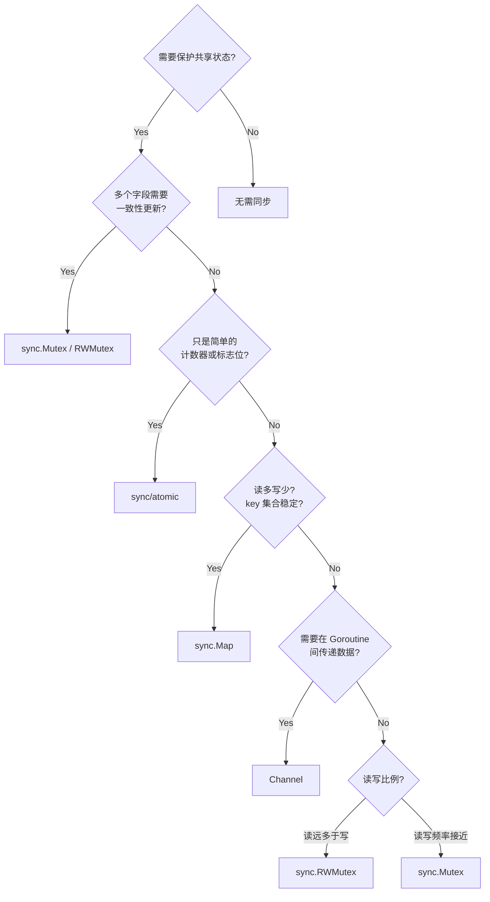

# sync 同步原语与 Atomic

## 6. sync.Mutex / sync.RWMutex

互斥锁用于保护共享资源的并发访问，是最基础的同步原语。

### Mutex 基本用法

```go
package main

import (
	"fmt"
	"sync"
)

type SafeCounter struct {
	mu sync.Mutex
	v  map[string]int
}

func (c *SafeCounter) Inc(key string) {
	c.mu.Lock()
	defer c.mu.Unlock()
	c.v[key]++
}

func (c *SafeCounter) Value(key string) int {
	c.mu.Lock()
	defer c.mu.Unlock()
	return c.v[key]
}

func main() {
	counter := SafeCounter{v: make(map[string]int)}
	var wg sync.WaitGroup

	for i := 0; i < 1000; i++ {
		wg.Add(1)
		go func() {
			defer wg.Done()
			counter.Inc("key")
		}()
	}

	wg.Wait()
	fmt.Println("final count:", counter.Value("key")) // 1000
}
```

### RWMutex 读写锁

```go
package main

import (
	"fmt"
	"sync"
	"time"
)

type Cache struct {
	mu   sync.RWMutex
	data map[string]string
}

func (c *Cache) Get(key string) (string, bool) {
	c.mu.RLock() // 读锁，多个读者可同时持有
	defer c.mu.RUnlock()
	val, ok := c.data[key]
	return val, ok
}

func (c *Cache) Set(key, value string) {
	c.mu.Lock() // 写锁，排斥所有读者和写者
	defer c.mu.Unlock()
	c.data[key] = value
}

func main() {
	cache := &Cache{data: make(map[string]string)}
	cache.Set("name", "Go")

	var wg sync.WaitGroup

	// 多个并发读
	for i := 0; i < 10; i++ {
		wg.Add(1)
		go func(id int) {
			defer wg.Done()
			if val, ok := cache.Get("name"); ok {
				fmt.Printf("reader %d: %s\n", id, val)
			}
		}(i)
	}

	// 偶尔写
	wg.Add(1)
	go func() {
		defer wg.Done()
		time.Sleep(5 * time.Millisecond)
		cache.Set("name", "Golang")
		fmt.Println("writer: updated")
	}()

	wg.Wait()
}
```

### 讲解重点

- **Mutex vs RWMutex**：读多写少用 `RWMutex`，读写频率接近时 `RWMutex` 因内部开销反而可能更慢，直接用 `Mutex` 即可。
- **不要复制锁**：`sync.Mutex` 和 `sync.RWMutex` 不能被复制。包含锁的结构体应通过指针传递。可用 `go vet` 检查。
- **避免死锁**：不要在持有锁的情况下再去获取同一把锁（Go 的 Mutex 不可重入）；多把锁时统一加锁顺序。
- **defer Unlock**：建议用 `defer mu.Unlock()` 确保异常路径也能释放锁，但注意 defer 在函数返回时才执行，如果临界区很小，可以手动 Unlock 缩小锁范围。


---

## 7. Atomic 原子操作

`sync/atomic` 提供无锁的原子操作，适用于简单的计数器、标志位等场景，性能优于互斥锁。

### 基本原子操作

```go
package main

import (
	"fmt"
	"sync"
	"sync/atomic"
)

func main() {
	var counter int64

	var wg sync.WaitGroup
	for i := 0; i < 1000; i++ {
		wg.Add(1)
		go func() {
			defer wg.Done()
			atomic.AddInt64(&counter, 1) // 原子自增
		}()
	}
	wg.Wait()

	fmt.Println("counter:", atomic.LoadInt64(&counter)) // 1000
}
```

### CompareAndSwap (CAS)

```go
package main

import (
	"fmt"
	"sync/atomic"
)

func main() {
	var val int64 = 100

	// CAS：如果当前值是 100，就替换成 200
	swapped := atomic.CompareAndSwapInt64(&val, 100, 200)
	fmt.Println("swapped:", swapped, "val:", val) // true, 200

	// 当前值是 200 而不是 100，交换失败
	swapped = atomic.CompareAndSwapInt64(&val, 100, 300)
	fmt.Println("swapped:", swapped, "val:", val) // false, 200
}
```

### atomic.Value 存取任意类型

```go
package main

import (
	"fmt"
	"sync/atomic"
	"time"
)

type Config struct {
	Timeout  time.Duration
	MaxRetry int
}

func main() {
	var configStore atomic.Value

	// 初始配置
	configStore.Store(Config{
		Timeout:  5 * time.Second,
		MaxRetry: 3,
	})

	// 模拟热更新配置
	go func() {
		time.Sleep(100 * time.Millisecond)
		configStore.Store(Config{
			Timeout:  10 * time.Second,
			MaxRetry: 5,
		})
		fmt.Println("config updated")
	}()

	// 读取配置（无锁）
	cfg := configStore.Load().(Config)
	fmt.Printf("current config: timeout=%v, maxRetry=%d\n", cfg.Timeout, cfg.MaxRetry)

	time.Sleep(200 * time.Millisecond)
	cfg = configStore.Load().(Config)
	fmt.Printf("updated config: timeout=%v, maxRetry=%d\n", cfg.Timeout, cfg.MaxRetry)
}
```

### 讲解重点

- **适用场景**：计数器、标志位、配置热加载等简单共享状态。复杂逻辑（多个字段需一致性更新）仍应使用 Mutex。
- **CAS 的自旋**：CAS 可能因竞争失败，通常需要在循环中重试。高竞争场景下自旋会浪费 CPU，此时 Mutex 更合适。
- **atomic.Value 类型一致**：存入 `atomic.Value` 后，后续 Store 的值类型必须一致，否则 panic。
- **内存序**：Go 的 atomic 操作提供顺序一致性保证，能正确建立 happens-before 关系。


---

## 8. WaitGroup / Once / Cond / Pool

`sync` 包提供了多种同步原语，覆盖常见的并发协调场景。

### WaitGroup：等待一组 Goroutine 完成

```go
package main

import (
	"fmt"
	"sync"
	"time"
)

func main() {
	var wg sync.WaitGroup

	for i := 1; i <= 5; i++ {
		wg.Add(1) // 必须在 go 之前调用
		go func(id int) {
			defer wg.Done()
			time.Sleep(time.Duration(id) * 100 * time.Millisecond)
			fmt.Printf("task %d done\n", id)
		}(i)
	}

	wg.Wait() // 阻塞直到计数器归零
	fmt.Println("all tasks completed")
}
```

### Once：保证只执行一次

```go
package main

import (
	"fmt"
	"sync"
)

type Singleton struct {
	Name string
}

var (
	instance *Singleton
	once     sync.Once
)

func GetInstance() *Singleton {
	once.Do(func() {
		fmt.Println("initializing singleton...")
		instance = &Singleton{Name: "only-one"}
	})
	return instance
}

func main() {
	var wg sync.WaitGroup
	for i := 0; i < 10; i++ {
		wg.Add(1)
		go func() {
			defer wg.Done()
			s := GetInstance()
			fmt.Println("got:", s.Name)
		}()
	}
	wg.Wait()
	// "initializing singleton..." 只打印一次
}
```

### Cond：条件变量

```go
package main

import (
	"fmt"
	"sync"
	"time"
)

func main() {
	var mu sync.Mutex
	cond := sync.NewCond(&mu)

	ready := false

	// 等待方
	go func() {
		mu.Lock()
		for !ready { // 必须在循环中检查条件，防止虚假唤醒
			cond.Wait() // 释放锁 + 等待通知 + 重新获取锁
		}
		fmt.Println("consumer: condition met, proceeding")
		mu.Unlock()
	}()

	// 通知方
	time.Sleep(500 * time.Millisecond)
	mu.Lock()
	ready = true
	cond.Signal() // 唤醒一个等待者；Broadcast() 唤醒所有
	mu.Unlock()

	time.Sleep(100 * time.Millisecond)
}
```

### Pool：对象池复用

```go
package main

import (
	"bytes"
	"fmt"
	"sync"
)

func main() {
	pool := &sync.Pool{
		New: func() interface{} {
			fmt.Println("creating new buffer")
			return new(bytes.Buffer)
		},
	}

	// 获取 -> 使用 -> 归还
	buf := pool.Get().(*bytes.Buffer)
	buf.WriteString("hello pool")
	fmt.Println(buf.String())

	buf.Reset() // 归还前清理状态
	pool.Put(buf)

	// 再次获取，复用刚才归还的对象
	buf2 := pool.Get().(*bytes.Buffer)
	fmt.Println("reused buffer, len:", buf2.Len()) // 0，已 Reset
}
```

### 讲解重点

- **WaitGroup.Add 的时机**：`Add` 必须在启动 Goroutine 之前调用，否则 `Wait` 可能在 `Add` 之前返回。不要在 Goroutine 内部调用 `Add`。
- **Once 的 panic 语义**：如果 `once.Do(f)` 中的 `f` 发生 panic，`once` 仍然被标记为已执行，后续调用不会重试。Go 1.21+ 提供 `sync.OnceFunc` / `sync.OnceValue` 可以更优雅地处理。
- **Cond 不常用**：实际开发中 Channel 能覆盖绝大多数条件等待场景，`sync.Cond` 通常只在需要 `Broadcast` 唤醒多个等待者且不方便用 Channel 时使用。
- **Pool 的 GC 行为**：`sync.Pool` 中的对象可能在任意 GC 周期被回收，不要把它当缓存用。典型场景是高频分配的临时对象（如 `bytes.Buffer`、编解码器）。


---

## 9. sync.Map

`sync.Map` 是 Go 标准库提供的并发安全 Map，针对两种场景做了优化：key 写入一次后多次读取，以及多个 Goroutine 读写不相交的 key 集合。

### 基本用法

```go
package main

import (
	"fmt"
	"sync"
)

func main() {
	var m sync.Map

	// Store 写入
	m.Store("name", "Go")
	m.Store("version", 21)

	// Load 读取
	if val, ok := m.Load("name"); ok {
		fmt.Println("name:", val)
	}

	// LoadOrStore 不存在就写入
	actual, loaded := m.LoadOrStore("name", "Rust")
	fmt.Println("actual:", actual, "loaded:", loaded) // Go, true（已存在）

	// Delete 删除
	m.Delete("version")

	// Range 遍历
	m.Store("lang", "Go")
	m.Store("year", 2009)
	m.Range(func(key, value interface{}) bool {
		fmt.Printf("  %v: %v\n", key, value)
		return true // 返回 false 停止遍历
	})
}
```

### 并发读写对比

```go
package main

import (
	"fmt"
	"sync"
	"time"
)

func benchSyncMap() time.Duration {
	var m sync.Map
	var wg sync.WaitGroup
	start := time.Now()

	for i := 0; i < 100; i++ {
		wg.Add(1)
		go func(id int) {
			defer wg.Done()
			for j := 0; j < 1000; j++ {
				if j%10 == 0 {
					m.Store(id, j) // 10% 写
				} else {
					m.Load(id) // 90% 读
				}
			}
		}(i)
	}

	wg.Wait()
	return time.Since(start)
}

func benchMutexMap() time.Duration {
	mu := &sync.RWMutex{}
	data := make(map[int]int)
	var wg sync.WaitGroup
	start := time.Now()

	for i := 0; i < 100; i++ {
		wg.Add(1)
		go func(id int) {
			defer wg.Done()
			for j := 0; j < 1000; j++ {
				if j%10 == 0 {
					mu.Lock()
					data[id] = j
					mu.Unlock()
				} else {
					mu.RLock()
					_ = data[id]
					mu.RUnlock()
				}
			}
		}(i)
	}

	wg.Wait()
	return time.Since(start)
}

func main() {
	fmt.Println("sync.Map:", benchSyncMap())
	fmt.Println("RWMutex+map:", benchMutexMap())
}
```

### 讲解重点

- **适用场景**：key 稳定（写少读多）或各 Goroutine 操作不同 key 集合。这两种场景下 `sync.Map` 内部的 read-only 快路径能避免加锁。
- **不适用场景**：key 频繁增删、写入比例高的场景。此时 `sync.Map` 的双 map（read/dirty）切换开销反而更大，不如 `RWMutex` + 普通 map。
- **类型安全**：`sync.Map` 的 key 和 value 都是 `interface{}`/`any`，没有泛型约束。如果需要类型安全，可以自己封装或使用第三方库。
- **无法获取长度**：`sync.Map` 没有 `Len()` 方法，只能通过 `Range` 遍历计数，这本身就说明它不适合需要频繁统计大小的场景。

### sync 原语选择决策图

回顾 Section 6-9 的各种同步原语，可以按以下决策树选择：



